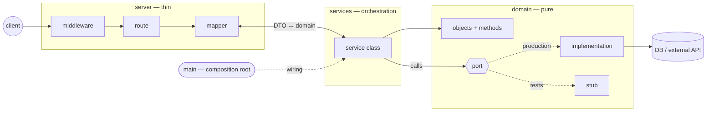

# Domain-Driven Architecture

## What & why

Strictly separate **business logic** (domain), **orchestration** (services) and **infrastructure** (server). The domain is pure and testable in isolation. Services orchestrate the domain without knowing implementation details. The server is a thin layer connecting the outside world to services.

Each layer depends only on the layer below it through **interfaces (ports)**, never through concrete implementations. Dependencies are injected explicitly from a single composition root (`main`) through a **typed `Deps` object + constructor**; functional options exist only for optional tunables ([[dependency-injection]]).

> This is E-Sensia's pragmatic take on DDD: layers + ports & adapters, focused on separation and testability rather than the full Evans toolbox. **This note is the language-agnostic constitution** — it applies to every repo. Per-stack conventions ([[ddd-in-typescript]], [[ddd-in-go]], [[ddd-in-python]]) implement it and never contradict it; a forced deviation is an ADR in the repo plus, if systemic, a change here.

## The rules at a glance

1. Business logic lives in `domain`, orchestration in `services`, `server` stays thin.
2. Dependencies point downward only — no upward import, ever.
3. Every port has at least one implementation and one stub; ports expose capabilities, not tables.
4. Services receive a typed `Deps` object at construction; a missing dependency is a compile/lint error, never a runtime surprise.
5. Only `main` imports the config; everything else receives primitives.
6. Mappers validate shape, the domain enforces invariants, illegal states are unrepresentable.
7. Expected errors are typed and part of the interface; the server maps them once; nothing internal leaks.
8. Logs, metrics and traces are injected ports; correlation ids travel explicitly.
9. One port call is the atomicity unit; writes are idempotent.
10. Three test files per service (`happy`/`error`/`stress`); assert outcomes, never calls.
11. Everything machine-checkable is CI-enforced; deviations are ADRs.
12. Every repo ships `CONTEXT.md`, health endpoints, graceful shutdown and versioned migrations.

## Canonical project structure

```
project/
├── CONTEXT.md                        # domain glossary (ubiquitous language)
├── docs/adr/                         # architecture decision records
├── migrations/                       # versioned schema migrations
├── main                              # composition root, wiring, lifecycle
├── config/
│   ├── config                        # class + parsing + validation
│   └── config.test                   # parsing and logic tests
├── utils/
│   ├── injection/                    # generic Inject function
│   └── testutils/                    # shared test helpers
├── domain/
│   ├── shared/                       # foundational cross-domain objects
│   └── [category]/
│       ├── model                     # objects + methods + ports (interfaces)
│       ├── model.test                # unit tests for methods
│       ├── [implementation]/
│       │   ├── implementation        # concrete implementation of a port
│       │   └── implementation.test
│       └── stub/
│           └── implementation        # stub for tests
├── services/
│   └── [service]/
│       ├── interfaces/
│       │   └── [service-dependency]/
│       │       ├── interface         # local contract for the dependency
│       │       └── stub              # stub for the dependency
│       ├── service                   # service class/struct
│       ├── inject                    # optional tunables (functional options), if any
│       ├── service.happy.test        # happy paths
│       ├── service.error.test        # expected errors
│       └── service.stress.test       # panics, load, technical errors
└── server/
    ├── routes                        # endpoint definitions
    ├── mappers                       # DTO <-> domain objects
    └── middlewares                   # technical middleware (CORS, etc.)
```

## The 3 layers

| Layer | Contains | Depends on | Never contains |
|---|---|---|---|
| `domain` | objects, transformation methods, ports, implementations, stubs | `utils`, `domain/shared` | references to services or server |
| `services` | orchestration classes, local interfaces, `inject` files | domain ports + objects, `utils` | concrete implementations, server code |
| `server` | routes, mappers, middlewares | services (via interfaces), domain objects, `utils` | business logic |

A request crosses the system like this:



### Domain

The domain contains **all business logic**: objects (entities, value objects), transformation methods on those objects, and **ports** (interfaces) that describe required technical capabilities without implementing them.

**What is a category?** A business capability named in the domain language (`user`, `regulation`, `billing`) — never a technical grouping. Its vocabulary lives in the repo's `CONTEXT.md` glossary, which bridges to this KB's `entity` notes. Create a new category when a concept has its own objects and rules; split one when unrelated ports accumulate. `domain/shared/` stays tiny — foundational objects used by 3+ categories. If `shared/` grows, a category is missing.

Rules:

- No dependencies on services or server.
- Objects and the interfaces that use them live in the same file. Multiple files per category are allowed if the need grows.
- **Every port has at least one concrete implementation and one stub.**
- **Ports expose capabilities shaped by their consumers, not storage schemas** — avoid reflexively mirroring tables with full CRUD interfaces ([[deep-modules]]).
- **Make illegal states unrepresentable.** Identifiers are distinct types (`UserId`, never a raw `string`) so they cannot be swapped; mutually exclusive states are discriminated unions, not combinable booleans. Per-stack mechanics in the conventions.
- Cross-category dependencies within the domain are possible but should be limited. Shared foundational objects live in `domain/shared/`.
- Transformation methods are pure (return results, no side effects) and unit tested (`model.test`).

### Services

Services **orchestrate the domain**. Each service is a class that receives its dependencies (domain ports and other service interfaces) via [[dependency-injection]].

Rules:

- A service depends on the domain through ports (interfaces), never through implementations.
- If service A depends on service B, **service A defines its own local interface for B** in `interfaces/`, with a stub. Service A does not know about service B's folder.
- Each service declares its dependencies in a typed `Deps` object/struct next to the class; optional tunables (if any) are functional options.
- **A service's expected errors are part of its interface**: typed, enumerated, asserted in `service.error.test`.
- Tests assemble the service exactly like production does, with stubs.

### Server

The server is a **thin layer**: routes, mappers (request/response ↔ domain objects), and purely technical middlewares.

Rules:

- All business logic lives in the domain or services, never in the server.
- **Writes: one endpoint = one service entry point.** Reads: an endpoint may compose several service calls (dashboards, aggregated views) — composition of reads is presentation, not business logic.
- **Authentication is a service. Logging is a port** injected into services.
- Mappers transform DTOs (JSON, protobuf, etc.) into domain objects and vice versa — domain objects are never serialized raw.

## Config

Config is a class at the project root handling parsing (environment variables, files, flags) and validation.

**Absolute rule: only `main` imports the config.** Services and the domain receive primitive values (a URL, a timeout, a flag) as constructor deps or `with...` tunables, never the config object itself. No config singleton/global accessor — loading returns a value (or an error) to `main` only. If the config contains validation logic, it is tested in `config.test`.

## Dependency injection

Three invariants, whatever the language:

- **`main` is the single composition root** — the only place that knows concrete implementations.
- **A service declares its dependencies in one visible place**, and tests assemble it exactly like production, with stubs.
- **A missing dependency fails fast** — at compile time, in CI, or at composition time — never as a null failure at first use in production.

The mechanism is the same everywhere: a **typed `Deps` object/struct + constructor** — TypeScript object literals enforce completeness at compile time, Go adds the `exhaustruct` lint, in Python the service is a dataclass whose required fields pyright checks at every callsite. **Functional options** (`with...`/`With...`) exist only for optional tunables with sane defaults (in Python, keyword defaults already play that role) ([[dependency-injection]]). No DI framework, no container, anywhere.

## Utils

`utils/` contains code reusable across the entire project: the `Inject` function, test helpers, generic utilities (retry, formatting, etc.). **This folder has no dependencies on domain, services, or server.**

## Dependency rules (summary)

```
main ──> config, domain/*, services/*, server, utils
server ──> services (via interfaces), domain (objects), utils
services ──> domain (ports + objects), utils
domain ──> utils (optionally), domain/shared
utils ──> nothing
```

**No arrow points upward**: domain knows neither services nor server. Services don't know about server. Server doesn't know about concrete domain implementations — `main` is the only place that connects them.

## Validation & invariants

Three kinds of "is this data acceptable", three owners — never mixed, never duplicated:

| Kind | Example | Owner | On failure |
|---|---|---|---|
| **Shape** | field present, parseable date, valid JSON | mapper, at the edge | transport 4xx, no service runs |
| **Invariant** | an emergency level is 1–5, an email is an email | domain constructors / factories | invalid object cannot be built |
| **Precondition** | user exists, balance sufficient | service, as the use case | typed expected error |

- **A domain object that exists is valid.** Services never re-validate invariants — if they feel the need to, the domain type is too weak (raw primitive instead of value object).
- Prefer value objects with smart constructors over raw primitives; combined with distinct identifier types, most invalid programs stop compiling.

## Error handling

An error is either **expected** (a business outcome: user not found, payment declined) or **unexpected** (a technical failure: timeout, connection reset, panic). The distinction drives the whole doctrine:

- The domain defines error types for business-rule violations, next to the objects they concern.
- A service enumerates its expected errors as typed errors — they are part of its interface and are tested in `service.error.test`. Unexpected errors propagate untouched (`service.stress.test`).
- **The server translates typed errors into transport responses in one place** (error mapper or dedicated middleware). The wire carries a stable `snake_case` code plus the `request_id`, nothing else — internal messages and stack traces never cross the boundary; an unknown error becomes a generic 5xx (`internal`), logged with its correlation id.
- **Handle once.** An error is recovered, translated, or propagated — never logged *and* rethrown at every level.

Cross-cutting details (retry policies, error taxonomy): [[error-handling]].

## Observability

- **Logging, metrics and tracing are ports**, injected into services like any other dependency. No global logger, no telemetry singleton.
- Transport-level telemetry (request spans, access logs) lives in server middlewares.
- **Correlation identifiers are created at the edge** (middleware) and travel explicitly (argument or context object), never via global state.
- **The business correlation id is `conversation_id`** — generated once at the telephony edge when an emergency call is received, propagated via `X-Conversation-Id`, present on every log line of the call's lifetime, never sampled. Only the call-reception edge generates it.
- Log shape, levels and canonical fields: [[log-format]].

## Security

- **Authentication is a service** (who you are). **Authorization is decided in the service layer** (who may do what — that's a business rule): routes carry identity, they don't decide.
- **No secret and no personal or medical data in logs or error messages.** Telemetry ports make the safe path the easy path: structured fields with explicit allowlists, never free-form object dumps. Health-data obligations (HDS/RGPD) live in the business KB.
- Input hygiene at the edge: middlewares enforce payload size limits and rate limits before anything reaches a mapper.

## Transactions & consistency

- **The atomicity unit is one port call.** Design ports so a business write is atomic behind a single method (e.g. `saveOrderWithPayment`), backed by the infrastructure's transaction inside the implementation. Never leak transaction handles through a port.
- A service therefore never coordinates several port writes that must succeed or fail together — if that need appears, the port is the wrong shape: give one port a composite method.
- **Writes are idempotent or reject duplicates explicitly.** Network retries and double submissions are certainties, not edge cases. A port documents its concurrency semantics (idempotency key, optimistic version, last-write-wins) as part of its interface.
- Cross-service consistency (sagas, compensation) is exceptional and requires an ADR.

## Operational contract

What every deployable repo provides, beyond passing tests:

- **Health and readiness endpoints.** Readiness reflects real dependencies (DB reachable, config valid); wired in the server, no business logic.
- **Graceful shutdown**: stop accepting work, drain in-flight requests, close pools and connections. `main` owns the lifecycle — symmetric with the wiring it owns at startup.
- **Timeouts and retries are properties of port implementations**, tuned via primitives injected from `main`. A service never sleeps or retries by itself — resilience policy lives in the adapter (helpers in `utils/retry`).
- **Migrations are versioned in the repo** (`migrations/`) and ship with the port-implementation change that needs them, applied before the new code serves traffic.
- **DTO evolution is additive** (tolerant reader): mappers ignore unknown fields and never repurpose existing ones; a breaking change is a new endpoint version.

## Test strategy

| File | Layer | Covers |
|---|---|---|
| `model.test` | domain | transformation methods, unit level |
| `implementation.test` | domain | each concrete implementation of a port |
| `config.test` | config | parsing and validation logic |
| `service.happy.test` | services | all happy paths, nominal behaviors |
| `service.error.test` | services | expected errors: bad interface responses, error handling, business edge cases |
| `service.stress.test` | services | technical errors: panics, timeouts, excessive load, unexpected behaviors |

- Service tests are wired through the stack's injection mechanism with stubs — the exact same path as production. See [[tdd]] for the loop and the seams.
- **Assert on outcomes through the interface, never on stub call counts or call order.**
- Stubs of local service interfaces are mocks of code we own: keep a few **composed integration tests** per feature (service A + real service B, stubs only at the ports) so the wiring itself is exercised.

## Enforcement

A rule that can be checked by a machine must be — a CI failure needs no discipline:

- **CI enforces**: dependency direction (no upward imports), one stub per port, the three test files per service. The tools are listed per stack in the conventions.
- **One Makefile interface everywhere** ([[makefile]]): canonical targets (`setup`/`format`/`lint`/`test`/`ci`/`build`/`run`), and GitHub workflows only call `make` targets — CI and local runs cannot drift.
- **Scaffolding**: each stack provides a generator producing the canonical file set for a new service or port. The boilerplate is absorbed; drift dies.
- **Each repo carries the standard through its [[llm-wiki]]**: `wiki/standard/` mirrors the relevant KB notes verbatim at a pinned KB SHA (`make wiki-check` in CI fails on drift), `wiki/local/` compounds repo-specific knowledge, and `CLAUDE.md` is the thin **generated** entry point — KB → repos sync is mechanical, not tribal.
- **Deviations are ADRs** (`docs/adr/`), recorded when the choice is hard to reverse, surprising without context, and a real trade-off. Systemic changes come back to this note — never silently into one repo.

## Checklists (definition of done)

**New port**
- [ ] Objects + port in `domain/<category>/model`, capability-oriented
- [ ] Invariants enforced by constructors/factories; identifiers are distinct types
- [ ] Concurrency semantics stated (idempotency, versioning) if the port writes
- [ ] One concrete implementation + `implementation.test`
- [ ] One stub in `stub/`
- [ ] Transformation methods covered in `model.test`

**New service**
- [ ] Orchestration only — no infrastructure detail, no transport types, no invariant re-checking
- [ ] Typed `Deps` object/struct declared next to the service; tunables (if any) as `with...` options
- [ ] Local interface + stub in `interfaces/` for each service dependency
- [ ] Expected errors typed and enumerated
- [ ] `happy` / `error` / `stress` test files
- [ ] Wired in `main`

**New endpoint**
- [ ] Route calls one service (write) or composes reads
- [ ] Mapper validates shape at the edge, both directions — no raw domain object on the wire
- [ ] Typed errors mapped to transport codes; nothing internal leaks

**New repo**
- [ ] Started from the stack template — first slice is a [[tracer-bullet]]
- [ ] `CONTEXT.md` glossary seeded, bridged to KB entities
- [ ] Health/readiness endpoints and graceful shutdown wired in `main`
- [ ] `migrations/` in place, applied before serving traffic
- [ ] CI checks wired (dependency direction, stubs, test trio)
- [ ] `CLAUDE.md` generated from the standard

## Design decisions (why it is this way)

So the choices don't get relitigated at every onboarding:

- **Why a `Deps` object + constructor instead of functional options for dependencies?** Options are, by definition, optional — required dependencies aren't. A typed `Deps` object documents the whole dependency surface in one place and lets the compiler (TS) or a lint (`exhaustruct`, Go) reject incomplete wiring before anything runs. Functional options remain the idiom for true tunables with defaults. (History: the standard originally used functional options for everything; unified on `Deps` + options on 2026-07-01.)
- **Why a local interface per consumer instead of shared service interfaces?** The consumer defines exactly what it needs (interface segregation); no import web between service folders; the stub lives next to the contract it stubs. Accepted cost: when service B's contract changes, consumers break at the composition root (`main`), away from the cause — that's the compiler doing its job; fix each consumer's contract consciously.
- **Why a mandatory stub per port?** A port with a single adapter is a hypothetical seam ([[deep-modules]]); the stub is the second adapter that proves the seam and makes [[tdd]] cheap.
- **Why is config quarantined in `main`?** A config object passed around is a hidden global — every consumer couples to every key. Primitives keep dependencies visible and services testable.
- **Why three test files per service?** They force failure-mode thinking: nominal (`happy`), expected business failures (`error`), technical chaos (`stress`) — three mindsets, three files.

## Pitfalls

- Business logic creeping into routes, mappers or middlewares.
- A service importing another service's folder instead of defining its local interface + stub.
- Passing the config object into a service instead of primitive values.
- A port without a stub — its consumers become untestable in isolation.
- Anemic domain: objects without transformation methods, all logic pushed into services.
- Raw `string`/`int` where a domain type belongs; re-validating invariants in services — both mean the domain type is too weak.
- CRUD ports mirroring tables — shallow interfaces, no leverage (apply the deletion test, [[deep-modules]]).
- A pass-through service that only forwards to a repo.
- Several port writes coordinated in a service when one composite port method should own the transaction.
- Retry or sleep logic inside a service — resilience belongs to adapters.
- Logging or telemetry through global singletons instead of injected ports.
- Secrets or personal data in logs or error messages.
- A catch-all that swallows unexpected errors and answers as if nothing happened.
- Deploys that kill in-flight requests because shutdown never drains.

## Related

- [[dependency-injection]] — the dependency injection pattern used everywhere
- [[ddd-in-typescript]] — TypeScript / Next.js implementation
- [[ddd-in-go]] — Go implementation
- [[ddd-in-python]] — Python / FastAPI implementation
- [[tdd]] — test-first workflow enabled by this architecture
- [[deep-modules]] — how to shape ports and services (seams, depth, deletion test)
- [[tracer-bullet]] — how to start a new repo: one thin slice through all layers
- [[error-handling]], [[log-format]] — cross-cutting doctrines (to be detailed)

*Sources: [DDD architecture (fr)](../../docs/sources/ddd/ddd-architecture-fr.md) ; [DDD architecture (en)](../../docs/sources/ddd/ddd-architecture-en.md) ; hardened 2026-07-01 through two architecture review passes (wiring validation, error doctrine, transactions & idempotency, validation & invariants, security, operational contract, enforcement).*
